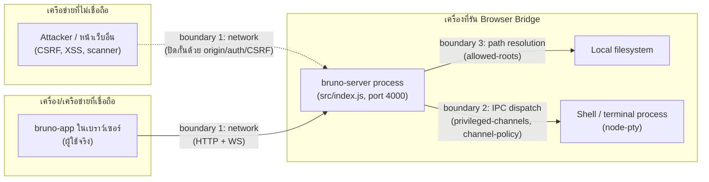

# Browser Bridge Threat Model

Improvement.md ข้อ 9.1 ("เขียน threat model ของ Browser Bridge และกำหนด trust boundaries") —
เอกสารนี้อธิบาย trust boundaries ของ `packages/bruno-server` ("Browser Bridge"), ภัยคุกคามที่
พิจารณาแล้วในแต่ละ boundary, mitigation ที่มีอยู่จริงในโค้ดตอนนี้ (อ้างอิงไฟล์จริง ไม่ใช่แผนใน
อนาคต), และความเสี่ยงที่ยอมรับไว้ (accepted risk) อย่างชัดเจน เอกสารนี้ควรอัปเดตทุกครั้งที่มีการ
เพิ่ม/เปลี่ยน security control ใน `src/security/` หรือ `src/routes/` — ให้ถือเป็นส่วนหนึ่งของ
"definition of done" สำหรับงานด้าน security เหมือนกับ unit test

## 1. ขอบเขตและวัตถุประสงค์

Browser Bridge คือ HTTP + WebSocket server (`src/index.js`, default `127.0.0.1:4000`) ที่ห่อ
`bruno-electron`'s IPC handler logic เดิมทั้งหมดไว้เบื้องหลัง REST endpoint
(`POST /api/ipc/:channel`) และ WebSocket event stream (`/ws/events`) เพื่อให้ `bruno-app`
(หน้าเว็บ) เรียกใช้งานความสามารถเดียวกับที่ Electron renderer เรียกผ่าน `ipcMain` ได้ โดยไม่ต้อง
แก้โค้ด handler เดิมเลยแม้แต่บรรทัดเดียว

**สิ่งที่ threat model นี้ครอบคลุม**: พื้นผิวโจมตี (attack surface) ที่เกิดขึ้น *เพราะ* เอา IPC
capability ที่เดิมเข้าถึงได้เฉพาะจาก process เดียวกัน (Electron main ↔ renderer ผ่าน
context-isolated preload) มาเปิดเป็น network service

**สิ่งที่ threat model นี้ไม่ครอบคลุม**: ช่องโหว่ในตัว handler logic เอง (เช่น path traversal
bug ภายใน handler ตัวใดตัวหนึ่งจาก 229 channel) — เหล่านั้นเป็นของ `bruno-electron` และมีอยู่ไม่ว่า
Browser Bridge จะมีอยู่หรือไม่ก็ตาม, ไม่ครอบคลุม dependency supply-chain risk, ไม่ครอบคลุม
`bruno-app` frontend code เอง (XSS ในหน้าเว็บ เป็นต้น) — นอกเหนือจากจุดที่ frontend คุยกับ Bridge
โดยตรง

## 2. Assets ที่ต้องปกป้อง

| Asset | ทำไมสำคัญ |
|---|---|
| Filesystem ของเครื่องที่รัน server | handler จำนวนมากอ่าน/เขียนไฟล์ตาม path ที่ client ส่งมา (import/export, save collection, ฯลฯ) |
| Process execution (`terminal:*`) | ให้ shell access เต็มรูปแบบบนเครื่องที่รัน server |
| Git credentials/remote (`renderer:clone-git-repository` และญาติ) | เขียน/อ่าน git remote ซึ่งอาจมี credential ฝังอยู่ |
| Secrets/environment variables ของ collection | ค่า auth token, API key ที่ผู้ใช้เก็บไว้ใน environment ของ Bruno |
| Session/CSRF token, bootstrap token | ใช้พิสูจน์ตัวตนผู้ใช้เมื่อเปิด auth |
| Availability ของ server process | handler ที่ hang หรือถูกยิงรัวๆ ทำให้ผู้ใช้จริงใช้งานไม่ได้ |

## 3. Actors และ Trust Boundaries

**Boundary 1 — เครือข่าย (ใครก็ตามที่คุยกับ port ของ Bridge ได้)**
ทุกสิ่งที่ไม่ใช่ตัว `bruno-server` process เองถือว่า untrusted โดยดีฟอลต์ ไม่ว่าจะเป็นผู้ใช้จริงผ่าน
`bruno-app`, หน้าเว็บอื่นที่เปิดพร้อมกันในเบราว์เซอร์เดียวกัน (CSRF/cross-origin vector), หรือ
เครื่องอื่นในเครือข่ายเดียวกันถ้า bind เป็น `0.0.0.0` มิติที่ควบคุม trust ตรงนี้: bind host
(`BRUNO_SERVER_HOST`, ดีฟอลต์ `127.0.0.1` — `src/index.js:38`), origin allowlist
(`security/origin-policy.js` — ดีฟอลต์อนุญาตเฉพาะ loopback origin), และ session/CSRF
(`security/auth.js` — opt-in ผ่าน `BRUNO_SERVER_REQUIRE_AUTH`)

**Boundary 2 — การ dispatch เข้า IPC handler (privileged capability)**
แม้ request จะผ่าน boundary 1 มาได้ (เช่น เป็นผู้ใช้จริงที่ auth แล้ว) ก็ไม่ได้แปลว่าควรเรียก
channel ไหนก็ได้แบบไม่มีข้อจำกัด — channel กลุ่ม shell execution / git remote mutation ถูกกันไว้
เป็น "privileged tier" แยกต่างหาก (`security/privileged-channels.js`)

**Boundary 3 — การ resolve path เข้า filesystem**
handler จำนวนมากรับ path จาก client โดยตรง (import/export/open file) เส้นแบ่งนี้บังคับว่า path
ที่ resolve แล้ว (รวมถึงหลัง symlink) ต้องอยู่ภายใน root ที่ตั้งค่าไว้เท่านั้น
(`security/allowed-roots.js`)

**Boundary 4 — ระหว่าง session ผู้ใช้ด้วยกันเอง** (มีความหมายเฉพาะเมื่อเปิด auth)
เมื่อมีหลาย session พร้อมกัน (หลาย browser tab/ผู้ใช้ต่อ Bridge เดียว) แต่ละ session ไม่ควรเห็น
event หรือควบคุม resource (เช่น terminal process) ของ session อื่น
(`session-context.js`, `ws/event-bridge.js#sendToSession`, `security/terminal-ownership.js`)

## 4. ภัยคุกคามต่อ boundary และ mitigation ที่มีอยู่จริง

### Boundary 1 — เครือข่าย

| ภัยคุกคาม | Mitigation | อยู่ที่ |
|---|---|---|
| เครื่องอื่นในเครือข่ายเดียวกันสแกนเจอ Bridge แล้วเรียก IPC ได้ตรงๆ | bind `127.0.0.1` เป็นดีฟอลต์ ต้องตั้ง `BRUNO_SERVER_HOST=0.0.0.0` เองถึงจะเปิด | `src/index.js` |
| หน้าเว็บอื่นที่เปิดพร้อมกันยิง fetch/WebSocket มาที่ Bridge แทนผู้ใช้ (CSRF, WS hijack) | origin allowlist ดีฟอลต์ loopback-only (`origin-policy.js`) + CORS middleware; WebSocket handshake เช็ค origin ก่อน accept | `security/origin-policy.js`, `ws/event-bridge.js` |
| ผู้ใช้ที่ไม่รู้ bootstrap token เรียก IPC ได้เลย | opt-in session auth: bootstrap token (timing-safe compare) → HttpOnly session cookie + CSRF token (double-submit) บน state-changing request | `security/auth.js` |
| CSRF ผ่าน session cookie ที่ browser แนบให้อัตโนมัติ | CSRF token แยกจาก cookie ต้องส่งผ่าน header `X-CSRF-Token` เท่านั้น (ไม่ใช่ cookie จึงไม่ถูกแนบอัตโนมัติข้าม origin) | `security/auth.js` |
| bootstrap token หลุดผ่าน log/history แล้วถูกใช้ซ้ำ (ไม่ใช่ single-use) | **ยังไม่ mitigate — accepted risk ดูข้อ 5** | — |
| client ยิง `POST /api/auth/session` (token exchange) รัวๆ ไม่จำกัด — ไม่ใช่ปัญหาเรื่อง brute-force (token สุ่ม 256 บิต เดาไม่ได้อยู่แล้ว) แต่เป็น availability/DoS: แต่ละ attempt เสีย CPU/response cycle ฟรีไม่จำกัดจำนวน | rate limit เฉพาะ endpoint นี้ แยกจาก IPC rate limit เดิม (คีย์ด้วย IP เพราะยังไม่มี session ตอนเรียก), ดีฟอลต์ 10 ครั้ง/5 นาที ปรับได้ผ่าน `BRUNO_SERVER_AUTH_RATE_LIMIT`/`BRUNO_SERVER_AUTH_RATE_WINDOW_MS` | `security/auth-rate-limit.js` |
| request/response ถูกดักฟังบนเครือข่าย (MITM) | **ไม่มี TLS ในตัว — accepted risk ดูข้อ 5** | — |
| client ยิง IPC รัวๆ จนตัด availability ของผู้ใช้อื่น/handler ค้าง | per-client rate limit (200 req/10s), concurrency limit (40 in-flight), handler timeout (30s) — ปรับได้ผ่าน env var | `security/ipc-limits.js` |
| WebSocket client ส่ง frame ใหญ่/ถี่ผิดปกติ, connection ค้างไม่ปิด | `maxPayload` 64KB, message rate limit (50 msg/10s ต่อ connection), ping/pong heartbeat 30s ตัด connection ที่ไม่ตอบ | `ws/event-bridge.js` |
| request body ใหญ่เกินจำเป็นสำหรับ channel ที่ควรมี payload เล็ก (เช่น UI toggle) | per-capability payload cap สำหรับ capability กลุ่ม `ui`/`system`/`notifications` (8-16KB) ก่อนถึง handler | `security/channel-policy.js` |

### Boundary 2 — Privileged IPC dispatch

| ภัยคุกคาม | Mitigation | อยู่ที่ |
|---|---|---|
| client เรียก `terminal:*` เพื่อรัน shell command ใดๆ บนเครื่อง server | `terminal:*` และ git remote-mutation channel (clone/connect/disconnect) ปิดโดยดีฟอลต์ ต้องตั้ง `BRUNO_SERVER_ENABLE_PRIVILEGED_CHANNELS=true` เอง | `security/privileged-channels.js` |
| args ของ channel ที่ privileged เปิดอยู่มีรูปแบบผิดจนทำให้ handler ทำงานผิดที่ (เช่น `terminal:kill` ได้ non-string) | schema validation เฉพาะ channel กลุ่มนี้ (arg count + type) — ตั้งใจไม่ทำ schema ให้ครบทุก 200+ channel เพราะ false-positive เสี่ยงกว่า | `security/channel-policy.js` (`CHANNEL_SCHEMAS`) |
| channel ที่ไม่มี handler จริงถูกยิงแล้วทำให้เกิดพฤติกรรมไม่คาดคิด | 404 `HANDLER_NOT_FOUND` ถ้าไม่มี handler ลงทะเบียนไว้จริง (ทั้ง `invoke` และ `emit`) | `routes/ipc-proxy.js` |

### Boundary 3 — Filesystem path resolution

| ภัยคุกคาม | Mitigation | อยู่ที่ |
|---|---|---|
| client ส่ง path แบบ `..` traversal ออกนอก root ที่อนุญาต | resolve แบบ absolute แล้วเช็คว่าอยู่ใต้ allowed root ก่อนถึง handler | `security/allowed-roots.js` |
| path อยู่ใต้ root ตามตัวอักษร แต่จริงๆ เป็น symlink ที่ชี้ออกไปนอก root | realpath ancestor ที่มีอยู่จริงก่อนเทียบ (แก้ทั้ง symlink ที่มีอยู่แล้วและ ancestor ที่เป็น symlink) | `security/allowed-roots.js` |
| ไม่ได้ตั้ง `BRUNO_SERVER_ALLOWED_ROOTS` เลย | **ดีฟอลต์คือไม่จำกัด (fail-open) — accepted risk ดูข้อ 5** | — |

### Boundary 4 — แยกระหว่าง session

| ภัยคุกคาม | Mitigation | อยู่ที่ |
|---|---|---|
| event ของ session A (เช่น preference ที่โหลดเสร็จ, ผลการรัน request) หลุดไปโผล่ที่ browser tab ของ session B | event ที่เกิดจาก IPC call ที่ auth แล้วถูก scope ด้วย `AsyncLocalStorage` แล้วส่งผ่าน `sendToSession` แทน `broadcast` | `session-context.js`, `ws/event-bridge.js` |
| session B รู้/เดา terminal sessionId ของ session A แล้วส่ง input/resize/kill เข้าไป | ownership map ผูก terminal sessionId กับ owner ตอน `terminal:create`, เช็คก่อน `input`/`resize`/`kill` ทุกครั้ง, filter `list-sessions` ให้เห็นเฉพาะของตัวเอง | `security/terminal-ownership.js` |
| ผู้ใช้ auth เปิดไว้แต่ session หมดอายุ/logout แล้วยัง credential/cookie เดิมใช้ต่อได้ | session มี TTL 24 ชม., `DELETE /api/auth/session` เรียก `revokeSession` ลบออกจาก map ทันที | `security/auth.js`, `routes/auth.js` |
| terminal process ที่ session เป็นเจ้าของยังรันค้างอยู่หลัง logout (leak, ไม่ใช่ cross-session access แต่เป็น resource ที่ควรตายไปพร้อม session) | `DELETE /api/auth/session` เดิน `getOwnedTerminals()` แล้ว kill ทุกตัวแบบ best-effort ก่อน `revokeSession` | `security/terminal-ownership.js`, `routes/auth.js` |
| collection watcher (filesystem, chokidar) ที่ session เป็นเจ้าของยังทำงานค้างอยู่หลัง logout แม้ไม่มี session ไหนพึ่งพาแล้ว | ref-counted ownership (`Map<watchPath, Set<sessionId>>`) — `removeWatcher()` จะถูกเรียกจริงก็ต่อเมื่อ session สุดท้ายที่ยังพึ่งพา path นั้นออกเท่านั้น ไม่ทำลาย watcher ที่ session อื่นยังใช้อยู่ | `security/watcher-ownership.js`, `routes/auth.js`, `routes/ipc-proxy.js` |

## 5. Accepted risk / gap ที่รู้อยู่แล้วและยังไม่ปิด

รายการนี้คือสิ่งที่ตั้งใจ "ยังไม่ทำ" ในตอนนี้ พร้อมเหตุผล ไม่ใช่สิ่งที่ถูกมองข้าม — ใครก็ตามที่จะ
deploy Browser Bridge นอกเครื่อง local ของตัวเองควรอ่านหัวข้อนี้ก่อน

1. **ไม่มี TLS ในตัว** — server ฟัง plain HTTP/WS เสมอ ถ้า `BRUNO_SERVER_HOST` ถูกตั้งให้ไม่ใช่
   loopback ต้องมี reverse proxy (nginx/caddy) ทำ TLS termination ให้เองเสมอ ไม่มีแผนทำ TLS
   ในตัว server เพราะ certificate management ไม่ใช่ concern ของ IPC bridge
2. **Bootstrap token ไม่ใช่ single-use** — `verifyBootstrapToken` เป็น static timing-safe
   compare ไม่มี consumption/burn logic เพราะฉะนั้น token เดียวแลก session ใหม่ได้หลายครั้งไม่จำกัด
   (เอาไปใช้ประโยชน์ตอน live-verify terminal isolation ด้วยตัวมันเอง) ถ้า token หลุดในช่วงที่ auth
   ยังเปิดอยู่ ผู้โจมตีสร้าง session ของตัวเองได้เรื่อยๆ **นี่เป็นการตัดสินใจตั้งใจ ไม่ใช่ของที่ลืมทำ**
   — token นี้ถูกออกแบบให้เป็น credential ที่แชร์กันได้ระหว่างหลาย client/ผู้ใช้ที่เข้าถึง Bridge
   เดียวกันได้ (สอดคล้องกับ P0.4 ที่รองรับหลาย session พร้อมกัน) ถ้าทำเป็น single-use จะจำกัดให้
   login ได้แค่ client เดียวต่อการ restart server หนึ่งครั้ง ขัดกับโมเดลการใช้งานนี้ mitigation ที่มี
   อยู่ตอนนี้คือ token ยาว 32 byte random, พิมพ์ทาง console ครั้งเดียวตอน startup เท่านั้น (ไม่มีทาง
   ดึงย้อนหลังถ้าไม่ได้เก็บ log ไว้), และ rate limit บน endpoint แลก token เอง
   (`security/auth-rate-limit.js`, ดูตาราง boundary 1 ข้างบน) ที่ปิด availability/DoS vector ของ
   endpoint นี้แยกต่างหากจากประเด็น single-use นี้
3. **`BRUNO_SERVER_ALLOWED_ROOTS` ไม่ได้บังคับตั้งค่า** — ถ้าไม่ตั้ง filesystem sandbox
   (`allowed-roots.js`) จะ fail-open คือไม่จำกัดอะไรเลย เหมือนก่อนมี P0.3 การตัดสินใจนี้สอดคล้องกับ
   pattern เดิมทั้งไฟล์ (ทุก control opt-in ไม่เปลี่ยนพฤติกรรมเดิมโดยดีฟอลต์) แต่หมายความว่า deploy
   ที่ไม่ได้อ่านเอกสารและไม่ตั้งค่าเองจะไม่มี sandbox เลย
4. **rate/concurrency limit เป็นแบบ in-memory ต่อ process เดียว** — ถ้า deploy เป็นหลาย instance
   ข้างหลัง load balancer ตัวจำกัดนี้จะนับแยกกันต่อ instance ไม่ได้รวมกัน (ตอนนี้ยังไม่มี pattern
   deploy แบบ multi-instance ในเอกสารไหนเลย จึงยังไม่ใช่ปัญหาจริงในทางปฏิบัติ)
5. **session-scoped isolation ยังไม่ครอบคลุมทุก resource type** — ตอนนี้มีแค่ event routing,
   terminal, และ filesystem watcher (boundary 4 สามแถวแรก) ยังไม่มีสำหรับ active
   workspace/collection state, secret/credential ต่อ session, หรือ per-user resource limit —
   ทั้งหมดนี้ต้องมี "session ownership" concept แบบเดียวกับ terminal/watcher ผูกกับ resource type
   อื่นเพิ่ม ซึ่งเป็นงานที่ใหญ่กว่า 1 increment ต่อ resource

## 6. คำแนะนำการ deploy (ไม่ใช่ default behavior — เป็น operator responsibility)

- อย่าเปิด port ของ Bridge สู่ Internet สาธารณะโดยตรง (มีคำเตือนนี้อยู่แล้วใน `Installation.md`)
- ถ้าต้องให้เข้าถึงนอกเครื่อง local: เปิด `BRUNO_SERVER_REQUIRE_AUTH=true`,
  `BRUNO_SERVER_ALLOWED_ORIGINS` ให้ตรง origin จริงเท่านั้น, `BRUNO_SERVER_ALLOWED_ROOTS` ให้แคบ
  ที่สุดเท่าที่ยังใช้งานได้จริง, วาง TLS-terminating reverse proxy ไว้ข้างหน้าเสมอ
- คง `BRUNO_SERVER_ENABLE_PRIVILEGED_CHANNELS=false` (ค่าดีฟอลต์) ไว้ เว้นแต่ผู้ใช้ที่เข้าถึง
  Bridge ทุกคนควรมีสิทธิ์รัน shell command บนเครื่องนั้นจริงๆ
