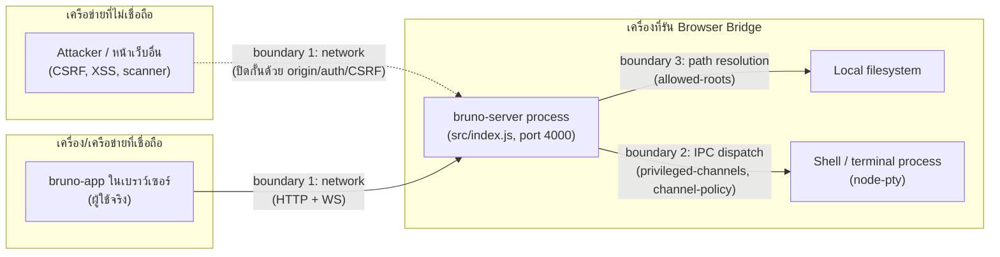

# Browser Bridge Threat Model

Improvement.md ข้อ 9.1 ("เขียน threat model ของ Browser Bridge และกำหนด trust boundaries") —
เอกสารนี้อธิบาย trust boundaries ของ `packages/bruno-server` ("Browser Bridge"), ภัยคุกคามที่
พิจารณาแล้วในแต่ละ boundary, mitigation ที่มีอยู่จริงในโค้ดตอนนี้ (อ้างอิงไฟล์จริง ไม่ใช่แผนใน
อนาคต), และความเสี่ยงที่ยอมรับไว้ (accepted risk) อย่างชัดเจน เอกสารนี้ควรอัปเดตทุกครั้งที่มีการ
เพิ่ม/เปลี่ยน security control ใน `src/security/` หรือ `src/routes/` — ให้ถือเป็นส่วนหนึ่งของ
"definition of done" สำหรับงานด้าน security เหมือนกับ unit test

## 1. ขอบเขตและวัตถุประสงค์

Browser Bridge คือ HTTP + WebSocket server (`src/index.js`, default `127.0.0.1:4000`) ที่ห่อ
`bruno-electron`'s IPC handler logic เดิมทั้งหมดไว้เบื้องหลัง REST endpoint
(`POST /api/ipc/:channel`) และ WebSocket event stream (`/ws/events`) เพื่อให้ `bruno-app`
(หน้าเว็บ) เรียกใช้งานความสามารถเดียวกับที่ Electron renderer เรียกผ่าน `ipcMain` ได้ โดยไม่ต้อง
แก้โค้ด handler เดิมเลยแม้แต่บรรทัดเดียว

**สิ่งที่ threat model นี้ครอบคลุม**: พื้นผิวโจมตี (attack surface) ที่เกิดขึ้น *เพราะ* เอา IPC
capability ที่เดิมเข้าถึงได้เฉพาะจาก process เดียวกัน (Electron main ↔ renderer ผ่าน
context-isolated preload) มาเปิดเป็น network service

**สิ่งที่ threat model นี้ไม่ครอบคลุม**: ช่องโหว่ในตัว handler logic เอง (เช่น path traversal
bug ภายใน handler ตัวใดตัวหนึ่งจาก 229 channel) — เหล่านั้นเป็นของ `bruno-electron` และมีอยู่ไม่ว่า
Browser Bridge จะมีอยู่หรือไม่ก็ตาม, ไม่ครอบคลุม dependency supply-chain risk, ไม่ครอบคลุม
`bruno-app` frontend code เอง (XSS ในหน้าเว็บ เป็นต้น) — นอกเหนือจากจุดที่ frontend คุยกับ Bridge
โดยตรง

## 2. Assets ที่ต้องปกป้อง

| Asset | ทำไมสำคัญ |
|---|---|
| Filesystem ของเครื่องที่รัน server | handler จำนวนมากอ่าน/เขียนไฟล์ตาม path ที่ client ส่งมา (import/export, save collection, ฯลฯ) |
| Process execution (`terminal:*`) | ให้ shell access เต็มรูปแบบบนเครื่องที่รัน server |
| Git credentials/remote (`renderer:clone-git-repository` และญาติ) | เขียน/อ่าน git remote ซึ่งอาจมี credential ฝังอยู่ |
| Secrets/environment variables ของ collection | ค่า auth token, API key ที่ผู้ใช้เก็บไว้ใน environment ของ Bruno |
| Session/CSRF token, bootstrap token | ใช้พิสูจน์ตัวตนผู้ใช้เมื่อเปิด auth |
| Availability ของ server process | handler ที่ hang หรือถูกยิงรัวๆ ทำให้ผู้ใช้จริงใช้งานไม่ได้ |

## 3. Actors และ Trust Boundaries

**Boundary 1 — เครือข่าย (ใครก็ตามที่คุยกับ port ของ Bridge ได้)**
ทุกสิ่งที่ไม่ใช่ตัว `bruno-server` process เองถือว่า untrusted โดยดีฟอลต์ ไม่ว่าจะเป็นผู้ใช้จริงผ่าน
`bruno-app`, หน้าเว็บอื่นที่เปิดพร้อมกันในเบราว์เซอร์เดียวกัน (CSRF/cross-origin vector), หรือ
เครื่องอื่นในเครือข่ายเดียวกันถ้า bind เป็น `0.0.0.0` มิติที่ควบคุม trust ตรงนี้: bind host
(`BRUNO_SERVER_HOST`, ดีฟอลต์ `127.0.0.1` — `src/index.js:38`), origin allowlist
(`security/origin-policy.js` — ดีฟอลต์อนุญาตเฉพาะ loopback origin), และ session/CSRF
(`security/auth.js` — opt-in ผ่าน `BRUNO_SERVER_REQUIRE_AUTH`)

**Boundary 2 — การ dispatch เข้า IPC handler (privileged capability)**
แม้ request จะผ่าน boundary 1 มาได้ (เช่น เป็นผู้ใช้จริงที่ auth แล้ว) ก็ไม่ได้แปลว่าควรเรียก
channel ไหนก็ได้แบบไม่มีข้อจำกัด — channel กลุ่ม shell execution / git remote mutation ถูกกันไว้
เป็น "privileged tier" แยกต่างหาก (`security/privileged-channels.js`)

**Boundary 3 — การ resolve path เข้า filesystem**
handler จำนวนมากรับ path จาก client โดยตรง (import/export/open file) เส้นแบ่งนี้บังคับว่า path
ที่ resolve แล้ว (รวมถึงหลัง symlink) ต้องอยู่ภายใน root ที่ตั้งค่าไว้เท่านั้น
(`security/allowed-roots.js`)

**Boundary 4 — ระหว่าง session ผู้ใช้ด้วยกันเอง** (มีความหมายเฉพาะเมื่อเปิด auth)
เมื่อมีหลาย session พร้อมกัน (หลาย browser tab/ผู้ใช้ต่อ Bridge เดียว) แต่ละ session ไม่ควรเห็น
event หรือควบคุม resource (เช่น terminal process) ของ session อื่น
(`session-context.js`, `ws/event-bridge.js#sendToSession`, `security/terminal-ownership.js`)

## 4. ภัยคุกคามต่อ boundary และ mitigation ที่มีอยู่จริง

### Boundary 1 — เครือข่าย

| ภัยคุกคาม | Mitigation | อยู่ที่ |
|---|---|---|
| เครื่องอื่นในเครือข่ายเดียวกันสแกนเจอ Bridge แล้วเรียก IPC ได้ตรงๆ | bind `127.0.0.1` เป็นดีฟอลต์ ต้องตั้ง `BRUNO_SERVER_HOST=0.0.0.0` เองถึงจะเปิด | `src/index.js` |
| หน้าเว็บอื่นที่เปิดพร้อมกันยิง fetch/WebSocket มาที่ Bridge แทนผู้ใช้ (CSRF, WS hijack) | origin allowlist ดีฟอลต์ loopback-only (`origin-policy.js`) + CORS middleware; WebSocket handshake เช็ค origin ก่อน accept | `security/origin-policy.js`, `ws/event-bridge.js` |
| ผู้ใช้ที่ไม่รู้ bootstrap token เรียก IPC ได้เลย | opt-in session auth: bootstrap token (timing-safe compare) → HttpOnly session cookie + CSRF token (double-submit) บน state-changing request | `security/auth.js` |
| CSRF ผ่าน session cookie ที่ browser แนบให้อัตโนมัติ | CSRF token แยกจาก cookie ต้องส่งผ่าน header `X-CSRF-Token` เท่านั้น (ไม่ใช่ cookie จึงไม่ถูกแนบอัตโนมัติข้าม origin) | `security/auth.js` |
| bootstrap token หลุดผ่าน log/history แล้วถูกใช้ซ้ำ (ไม่ใช่ single-use) | **ยังไม่ mitigate — accepted risk ดูข้อ 5** | — |
| client ยิง `POST /api/auth/session` (token exchange) รัวๆ ไม่จำกัด — ไม่ใช่ปัญหาเรื่อง brute-force (token สุ่ม 256 บิต เดาไม่ได้อยู่แล้ว) แต่เป็น availability/DoS: แต่ละ attempt เสีย CPU/response cycle ฟรีไม่จำกัดจำนวน | rate limit เฉพาะ endpoint นี้ แยกจาก IPC rate limit เดิม (คีย์ด้วย IP เพราะยังไม่มี session ตอนเรียก), ดีฟอลต์ 10 ครั้ง/5 นาที ปรับได้ผ่าน `BRUNO_SERVER_AUTH_RATE_LIMIT`/`BRUNO_SERVER_AUTH_RATE_WINDOW_MS` | `security/auth-rate-limit.js` |
| client เรียก `GET`/`DELETE /api/admin/allowed-roots` เพื่ออ่าน/แก้ filesystem sandbox config ระหว่างรัน (attack surface ใหม่ — ก่อนหน้านี้ config นี้อ่านจาก env var ตอน start เท่านั้น ไม่มี endpoint ให้ mutate ได้เลย) | mount หลัง `requireAuth` เหมือน `/api/ipc` ทุกประการ (ต้องมี session + CSRF header ถ้าเปิด auth); ออกแบบเป็น **revoke-only** โดยตั้งใจ — เรียกได้แค่ narrow allowed roots ให้แคบลง (ไม่มี un-revoke, ไม่มี add-root ผ่าน API) ทางเดียวที่จะขยายสิทธิ์กลับคือแก้ env var แล้ว restart process เอง ดังนั้นแม้ endpoint นี้ถูกเรียกโดยไม่ได้ตั้งใจหรือถูกละเมิด ผลลัพธ์แย่สุดคือ access แคบลง ไม่ใช่กว้างขึ้น; ทุกครั้งที่ revoke สำเร็จ log audit event ผูกกับ session | `routes/admin.js`, `security/allowed-roots.js`, `security/audit-log.js` |
| `GET /api/oauth2/callback` เป็น endpoint ใหม่ที่**ไม่ผ่าน `requireAuth`** เลย (จำเป็น — IdP redirect ไม่มี session cookie/CSRF token ให้แนบอยู่แล้ว, เหมือน desktop's custom-protocol handler เดิมทุกประการ) — client ใดๆ ที่เดา/รู้ `state` ที่ถูกต้องของ flow ที่กำลัง pending อยู่จะ resolve/reject แทนผู้ใช้จริงได้ | ป้องกันด้วย `state` unguessability เท่านั้น (128-bit random ผ่าน `generateState()`, เหมือน desktop เดิมทุกประการ ไม่ใช่ของใหม่); callback ที่ `state` ไม่ตรงกับ pending request ใดเลยถูกปฏิเสธ (fail closed, ไม่เดาว่าเป็นของ flow ไหน); ทุก resolve/reject log แค่ state + outcome (ไม่ log `code`); rate limit แยกต่างหาก (30 req/นาที/IP ดีฟอลต์); response HTML เป็น static ล้วนไม่ echo query param ดิบกลับเลยแม้แต่ตัวเดียว กัน XSS จาก input ที่ unauthenticated | `routes/oauth2.js`, `bruno-electron/src/utils/oauth2-protocol-handler.js`, `security/audit-log.js` |
| request/response ถูกดักฟังบนเครือข่าย (MITM) | opt-in TLS termination ในตัว server เอง — ตั้ง `BRUNO_SERVER_TLS_CERT_FILE`/`BRUNO_SERVER_TLS_KEY_FILE` (คู่กัน, validate ตอน start ผ่าน `config-validation.js`) ให้ REST เป็น HTTPS และ WS เป็น WSS อัตโนมัติ (ใช้ `http.Server`/`https.Server` object เดียวกัน); ดีฟอลต์ยังไม่ตั้งค่า (**accepted risk เมื่อไม่ได้เปิดใช้ — ดูข้อ 5**), certificate provisioning/renewal (ACME ฯลฯ) ไม่ใช่ scope ของ Bridge เอง เป็น operator responsibility เหมือน reverse-proxy path เดิม | `src/index.js`, `src/config-validation.js` |
| client ยิง IPC รัวๆ จนตัด availability ของผู้ใช้อื่น/handler ค้าง | per-client rate limit (200 req/10s), concurrency limit (40 in-flight), handler timeout (30s) — ปรับได้ผ่าน env var | `security/ipc-limits.js` |
| WebSocket client ส่ง frame ใหญ่/ถี่ผิดปกติ, connection ค้างไม่ปิด | `maxPayload` 64KB, message rate limit (50 msg/10s ต่อ connection), ping/pong heartbeat 30s ตัด connection ที่ไม่ตอบ | `ws/event-bridge.js` |
| request body ใหญ่เกินจำเป็นสำหรับ channel ที่ควรมี payload เล็ก (เช่น UI toggle) | per-capability payload cap สำหรับ capability กลุ่ม `ui`/`system`/`notifications` (8-16KB) ก่อนถึง handler | `security/channel-policy.js` |

### Boundary 2 — Privileged IPC dispatch

| ภัยคุกคาม | Mitigation | อยู่ที่ |
|---|---|---|
| client เรียก `terminal:*` เพื่อรัน shell command ใดๆ บนเครื่อง server | `terminal:*` และ git remote-mutation channel (clone/connect/disconnect) ปิดโดยดีฟอลต์ ต้องตั้ง `BRUNO_SERVER_ENABLE_PRIVILEGED_CHANNELS=true` เอง | `security/privileged-channels.js` |
| args ของ channel ที่ privileged เปิดอยู่มีรูปแบบผิดจนทำให้ handler ทำงานผิดที่ (เช่น `terminal:kill` ได้ non-string) | schema validation เฉพาะ channel กลุ่มนี้ (arg count + type) — ตั้งใจไม่ทำ schema ให้ครบทุก 200+ channel เพราะ false-positive เสี่ยงกว่า | `security/channel-policy.js` (`CHANNEL_SCHEMAS`) |
| channel ที่ไม่มี handler จริงถูกยิงแล้วทำให้เกิดพฤติกรรมไม่คาดคิด | 404 `HANDLER_NOT_FOUND` ถ้าไม่มี handler ลงทะเบียนไว้จริง (ทั้ง `invoke` และ `emit`) | `routes/ipc-proxy.js` |
| client เผลอ (หรือ script ยิงผิด) เรียก channel ที่ลบข้อมูลแบบกู้คืนไม่ได้ (delete item/environment/collection/cookie ฯลฯ) โดยไม่มีการยืนยันใดๆ | opt-in confirmation gate: ตั้ง `BRUNO_SERVER_REQUIRE_CONFIRMATION=true` แล้ว 11 channel ที่เป็น irreversible delete จริงๆ ต้องมี `confirm: true` ใน body ไม่งั้นได้ `428 CONFIRMATION_REQUIRED` — ปิดเป็นดีฟอลต์ (ไม่ตั้งค่า = ไม่มี behavior เปลี่ยน); เป็น server-side gate เท่านั้น ยังไม่มี UI confirm-dialog | `security/confirmation-policy.js`, `routes/ipc-proxy.js` |

### Boundary 3 — Filesystem path resolution

| ภัยคุกคาม | Mitigation | อยู่ที่ |
|---|---|---|
| client ส่ง path แบบ `..` traversal ออกนอก root ที่อนุญาต | resolve แบบ absolute แล้วเช็คว่าอยู่ใต้ allowed root ก่อนถึง handler | `security/allowed-roots.js` |
| path อยู่ใต้ root ตามตัวอักษร แต่จริงๆ เป็น symlink ที่ชี้ออกไปนอก root | realpath ancestor ที่มีอยู่จริงก่อนเทียบ (แก้ทั้ง symlink ที่มีอยู่แล้วและ ancestor ที่เป็น symlink) | `security/allowed-roots.js` |
| channel ที่ไม่รู้จัก (เขียนหรือไม่เขียนก็ไม่รู้) เรียกเข้า root ที่ผู้ใช้ตั้งใจให้อ่านอย่างเดียว (`:ro` suffix) จนเขียนทับไฟล์ reference/read-only ได้ | root ที่ตั้ง `:ro` บังคับว่ามีแค่ channel ในรายการที่ตรวจสอบมือแล้วว่าเป็น read-only จริง (`READ_ONLY_SAFE_CHANNELS`) เท่านั้นที่แตะได้ — channel อื่นทั้งหมด รวมถึงตัวที่ยังไม่รู้จักในอนาคต ถือเป็น write แล้วบล็อกอัตโนมัติ (fail-safe ไม่ใช่ fail-open) คืน `403 PATH_READ_ONLY_ROOT` แยกจาก `PATH_OUTSIDE_ALLOWED_ROOT` | `security/allowed-roots.js`, `@usebruno/rpc-contract`'s `ERROR_CODES` |
| ไม่ได้ตั้ง `BRUNO_SERVER_ALLOWED_ROOTS` เลย | **ดีฟอลต์คือไม่จำกัด (fail-open) — accepted risk ดูข้อ 5** | — |
| sandbox ปฏิเสธ path (outside-root หรือ read-only-root) แต่ไม่มีร่องรอยฝั่ง server ว่าใครพยายามเข้าถึงอะไร | log audit event ทุกครั้งที่ปฏิเสธ (channel, path ที่ถูกปฏิเสธ, session, requestId) — ไม่แตะ argument หรือ file content อื่นเลย | `security/audit-log.js`, `routes/ipc-proxy.js` |

### Boundary 4 — แยกระหว่าง session

| ภัยคุกคาม | Mitigation | อยู่ที่ |
|---|---|---|
| event ของ session A (เช่น preference ที่โหลดเสร็จ, ผลการรัน request) หลุดไปโผล่ที่ browser tab ของ session B | event ที่เกิดจาก IPC call ที่ auth แล้วถูก scope ด้วย `AsyncLocalStorage` แล้วส่งผ่าน `sendToSession` แทน `broadcast` | `session-context.js`, `ws/event-bridge.js` |
| session B รู้/เดา terminal sessionId ของ session A แล้วส่ง input/resize/kill เข้าไป | ownership map ผูก terminal sessionId กับ owner ตอน `terminal:create`, เช็คก่อน `input`/`resize`/`kill` ทุกครั้ง, filter `list-sessions` ให้เห็นเฉพาะของตัวเอง | `security/terminal-ownership.js` |
| ผู้ใช้ auth เปิดไว้แต่ session หมดอายุ/logout แล้วยัง credential/cookie เดิมใช้ต่อได้ | session มี TTL 24 ชม., `DELETE /api/auth/session` เรียก `revokeSession` ลบออกจาก map ทันที | `security/auth.js`, `routes/auth.js` |
| terminal process ที่ session เป็นเจ้าของยังรันค้างอยู่หลัง logout (leak, ไม่ใช่ cross-session access แต่เป็น resource ที่ควรตายไปพร้อม session) | `DELETE /api/auth/session` เดิน `getOwnedTerminals()` แล้ว kill ทุกตัวแบบ best-effort ก่อน `revokeSession` | `security/terminal-ownership.js`, `routes/auth.js` |
| collection watcher (filesystem, chokidar) ที่ session เป็นเจ้าของยังทำงานค้างอยู่หลัง logout แม้ไม่มี session ไหนพึ่งพาแล้ว | ref-counted ownership (`Map<watchPath, Set<sessionId>>`) — `removeWatcher()` จะถูกเรียกจริงก็ต่อเมื่อ session สุดท้ายที่ยังพึ่งพา path นั้นออกเท่านั้น ไม่ทำลาย watcher ที่ session อื่นยังใช้อยู่ | `security/watcher-ownership.js`, `routes/auth.js`, `routes/ipc-proxy.js` |
| HTTP cookie (session token, auth cookie ของ API ที่ทดสอบ) ที่ session A ตั้งไว้หลุดไปติดกับ request ที่ session B ยิงถึง domain เดียวกัน (single process-wide `CookieJar`) | jar ต่อ session แยกกันจริง เลือกใช้ผ่าน `AsyncLocalStorage` key เดียวกับที่ event routing ใช้ (`resolveJar()`), จบอายุ (`clearSessionJar`) ตอน logout — jar กลางเดิม (desktop/CLI/no-auth) ไม่ถูกแตะ ยังทำงานเหมือนเดิมทุกกรณี | `@usebruno/requests`'s `session-context.ts`, `cookies/index.ts`, `session-context.js`, `routes/auth.js` |
| session B รู้/เดา requestId ของ WebSocket หรือ gRPC connection ที่ session A เปิดค้างอยู่ (`wsClient`/`grpcClient` เป็น singleton เก็บด้วย requestId ล้วน ไม่รู้จัก session) แล้ว enumerate ผ่าน `get-active-connections`, ส่งข้อความแทรก, หรือปิด/cancel connection ของ A | ownership map ผูก requestId กับ owner ตอน `start-connection` สำเร็จ, เช็คก่อน `send-message`/`close-connection`/`end-request`/`cancel-request` ทุกครั้ง, filter `get-active-connections` ให้เห็นเฉพาะของตัวเอง, ปิด connection ที่ยังค้างอยู่ตอน logout | `security/connection-ownership.js`, `routes/ipc-proxy.js`, `routes/auth.js` |
| session เดียวสร้าง terminal/watched-collection ไม่จำกัดจำนวน หรือสร้าง session ใหม่ไม่จำกัดจำนวน (resource exhaustion บน server process เดียวที่ทุก session ใช้ร่วมกัน) | limit ต่อ session (terminal, watched path) และ limit รวมทั้ง server (concurrent session) อ่านจาก env var ปรับได้ ดีฟอลต์ 10/20/50 — เช็คก่อน dispatch เสมอ เกิน limit ปฏิเสธด้วย `429 RESOURCE_LIMIT_EXCEEDED` | `security/resource-limits.js`, `routes/auth.js`, `routes/ipc-proxy.js` |

### Boundary 5 — การเข้ารหัสข้อมูลลับที่พักอยู่ (data-at-rest, Improvement.md P1.4)

ไม่ใช่ trust boundary แบบ network/IPC/filesystem/session เหมือน 4 ข้อบน แต่เป็นมิติแยกที่ปกป้อง asset
"Secrets/environment variables ของ collection" (ข้อ 2) และ AI provider key/OAuth2 token โดยตรง — ใครก็ตามที่
อ่านไฟล์ `electron-store` (`ai-keys.json`, `oauth2.json`, `cookies.json`, `.bruno` collection files) บนเครื่อง
ที่รัน Bridge ได้ (เช่น ผ่านช่องโหว่อื่นที่ให้ arbitrary file read, หรือ backup ที่หลุด) ไม่ควรอ่านค่าลับ
ออกมาได้ง่ายกว่าที่ desktop's `safeStorage` ให้ไว้เดิม

| ภัยคุกคาม | Mitigation | อยู่ที่ |
|---|---|---|
| ciphertext ที่ plaintext เดียวกันได้ ciphertext เดียวกันเสมอ (fixed zero-IV AES-CBC เดิม) — เดา/เทียบว่าค่าลับสองตัวเท่ากันหรือไม่ได้แม้ไม่รู้ค่าจริง | AES-256-GCM พร้อม random IV ทุกครั้งที่ encrypt (algo tag `$02:`) แทนที่การเขียนใหม่ทั้งหมด, auth tag ตรวจ tamper/wrong-key เป็นของแถม; ciphertext เก่า (`$01:`) ยัง decrypt ได้ (backward-compat) แต่ไม่มีอะไรเขียนกลับไปเป็น format เก่าอีกแล้ว — migrate เป็น GCM อัตโนมัติทุกครั้งที่ store อ่าน-แก้ไข-เขียนค่ากลับ | `bruno-electron/src/utils/encryption.js` |
| Bridge ไม่เคยมี real master key ของตัวเอง — `safeStorage` shim เดิมคืน `isEncryptionAvailable() => false` เสมอ (dead-code stub) ทำให้ทุก secret ตกไปที่ key ที่ derive จาก `machineIdSync()` เสมอ เป็น key เดียวใช้ร่วมกันทั้ง server process ไม่มีการแยกต่อ deployment ไม่มีใครตั้งใจ generate ขึ้นมาเพื่อจุดประสงค์นี้ | generate random 32-byte master key จริงตอน deploy ครั้งแรก เก็บในไฟล์แยกต่างหาก (permission `0600`, directory `0700`, ไม่ปนกับไฟล์ ciphertext ใดๆ) แล้ว implement `safeStorage`-shaped shim จริงด้วย AES-256-GCM แทน stub — override ได้ผ่าน `BRUNO_SERVER_MASTER_KEY` (hex) สำหรับ deployment ที่ inject key ผ่าน secrets manager แทนไฟล์ local | `security/master-key.js`, `src/index.js` |
| master key เก็บอยู่ไฟล์เดียวกับ ciphertext ที่มันปกป้อง (`store/cookies.js` เดิม) — ใครอ่านไฟล์เดียวได้ก็ได้ทั้งคู่ | แยก `encryptedPasskey` ไปเก็บ `electron-store` คนละไฟล์ (`cookies-master-key`) จากไฟล์ ciphertext (`cookies`), มี one-time migration ย้าย key เก่าไปไฟล์ใหม่แล้วลบออกจากไฟล์เดิมเพื่อไม่ให้ cookie ที่เข้ารหัสไว้แล้วถอดรหัสไม่ได้ | `bruno-electron/src/store/cookies.js` |
| Base64 ถูกใช้เป็น encryption fallback แทนการเข้ารหัสจริง | สำรวจกว้างแล้วไม่พบว่ามีที่ไหนใช้ Base64 แทนการเข้ารหัส (มีแต่ Base64 legitimate สำหรับ HTTP Basic-Auth header/PKCE) — ตรวจแล้วไม่ใช่ gap | — |

## 5. Accepted risk / gap ที่รู้อยู่แล้วและยังไม่ปิด

รายการนี้คือสิ่งที่ตั้งใจ "ยังไม่ทำ" ในตอนนี้ พร้อมเหตุผล ไม่ใช่สิ่งที่ถูกมองข้าม — ใครก็ตามที่จะ
deploy Browser Bridge นอกเครื่อง local ของตัวเองควรอ่านหัวข้อนี้ก่อน

1. **TLS เป็น opt-in ไม่ใช่ default** — server ฟัง plain HTTP/WS ตามเดิมถ้าไม่ได้ตั้ง
   `BRUNO_SERVER_TLS_CERT_FILE`/`BRUNO_SERVER_TLS_KEY_FILE` (Improvement.md P1.3) deploy ที่ตั้ง
   `BRUNO_SERVER_HOST=0.0.0.0` โดยไม่ตั้ง TLS env var คู่นี้ (หรือไม่ได้วาง reverse proxy ที่ทำ TLS
   termination เองไว้ข้างหน้า) จะยังคุยกันแบบ plain text อยู่ — **เป็นการตัดสินใจ opt-in โดยตั้งใจ**
   (สอดคล้อง pattern เดิมทั้งไฟล์ที่ไม่เปลี่ยนพฤติกรรมดีฟอลต์) ไม่ใช่ของที่ลืมทำ Bridge เองรับผิดชอบแค่
   TLS termination (bring-your-own certificate) เท่านั้น ไม่รวม certificate provisioning/renewal
   (ACME, Let's Encrypt ฯลฯ) เป็น operator responsibility เหมือนกับตอนใช้ reverse proxy
2. **Bootstrap token ไม่ใช่ single-use** — `verifyBootstrapToken` เป็น static timing-safe
   compare ไม่มี consumption/burn logic เพราะฉะนั้น token เดียวแลก session ใหม่ได้หลายครั้งไม่จำกัด
   (เอาไปใช้ประโยชน์ตอน live-verify terminal isolation ด้วยตัวมันเอง) ถ้า token หลุดในช่วงที่ auth
   ยังเปิดอยู่ ผู้โจมตีสร้าง session ของตัวเองได้เรื่อยๆ **นี่เป็นการตัดสินใจตั้งใจ ไม่ใช่ของที่ลืมทำ**
   — token นี้ถูกออกแบบให้เป็น credential ที่แชร์กันได้ระหว่างหลาย client/ผู้ใช้ที่เข้าถึง Bridge
   เดียวกันได้ (สอดคล้องกับ P0.4 ที่รองรับหลาย session พร้อมกัน) ถ้าทำเป็น single-use จะจำกัดให้
   login ได้แค่ client เดียวต่อการ restart server หนึ่งครั้ง ขัดกับโมเดลการใช้งานนี้ mitigation ที่มี
   อยู่ตอนนี้คือ token ยาว 32 byte random, พิมพ์ทาง console ครั้งเดียวตอน startup เท่านั้น (ไม่มีทาง
   ดึงย้อนหลังถ้าไม่ได้เก็บ log ไว้), และ rate limit บน endpoint แลก token เอง
   (`security/auth-rate-limit.js`, ดูตาราง boundary 1 ข้างบน) ที่ปิด availability/DoS vector ของ
   endpoint นี้แยกต่างหากจากประเด็น single-use นี้
3. **`BRUNO_SERVER_ALLOWED_ROOTS` ไม่ได้บังคับตั้งค่า** — ถ้าไม่ตั้ง filesystem sandbox
   (`allowed-roots.js`) จะ fail-open คือไม่จำกัดอะไรเลย เหมือนก่อนมี P0.3 การตัดสินใจนี้สอดคล้องกับ
   pattern เดิมทั้งไฟล์ (ทุก control opt-in ไม่เปลี่ยนพฤติกรรมเดิมโดยดีฟอลต์) แต่หมายความว่า deploy
   ที่ไม่ได้อ่านเอกสารและไม่ตั้งค่าเองจะไม่มี sandbox เลย
4. **rate/concurrency limit เป็นแบบ in-memory ต่อ process เดียว** — ถ้า deploy เป็นหลาย instance
   ข้างหลัง load balancer ตัวจำกัดนี้จะนับแยกกันต่อ instance ไม่ได้รวมกัน (ตอนนี้ยังไม่มี pattern
   deploy แบบ multi-instance ในเอกสารไหนเลย จึงยังไม่ใช่ปัญหาจริงในทางปฏิบัติ)
5. **session-scoped isolation ยังไม่ครอบคลุมทุก resource type** — ตอนนี้มี event routing, terminal,
   filesystem watcher, HTTP cookie jar, WebSocket/gRPC connection (boundary 4 หกแถวบน), resource
   limit ต่อ session/รวมทั้ง server (แถวสุดท้าย), และ (increment ที่แปด, เสร็จแล้ว) 4 จุด active state
   ที่เคยยังไม่ implement: OAuth2 pending-request (scope ด้วย `state` param + `sessionKey` คู่กัน),
   `MountManager` (ref-counted `sessionKeys: Set` ต่อ mount แทน last-mount-wins), legacy
   active-global-environment (`activeGlobalEnvironmentUidBySession` map), และ
   last-opened-workspace/collection list (`...BySession` map ทั้งคู่) — ทุกจุด fallback เป็นพฤติกรรม
   เดิม 100% เมื่อไม่มี session context (desktop/no-auth mode) ดู `find bug and Improvement.md`
   increment ที่แปด สำหรับรายละเอียด (**secret/credential ต่อ session ตรวจสอบแล้วไม่ใช่ gap** —
   `EnvironmentSecretsStore`/`Oauth2Store` scope ตาม collection โดยตั้งใจ ไม่ใช่ตาม session เพราะต้อง
   แชร์กันได้ระหว่างหลาย session ที่ collaborate บน collection เดียวกัน; **"per-user" resource limit
   ตามที่ระบุใน `Improvement.md` เดิมกลายเป็น per-session** เพราะสถาปัตยกรรมนี้ไม่มี user identity จริง
   มีแค่ anonymous session จาก bootstrap token เดียวที่ตั้งใจให้ reuse ได้ — ดู `find bug and
   Improvement.md` increment ที่หกและเจ็ด; **gRPC connection ownership ยัง live-verify แบบ
   end-to-end ไม่ได้** เพราะต้องมี `.proto`/gRPC server จริงมาทดสอบ ใช้ unit test + code review แทน
   สำหรับตอนนี้ — ดู increment ที่เจ็ด; ที่เหลือที่ตั้งใจไม่แตะใน increment ที่แปด: `default-workspace.js`'s
   physical directory creation (product-level decision แยกต่างหาก) และ onboarding-promise singleton
   ใน `preferences.js` — **ตัดสินใจแล้ว (ไม่ใช่ gap)**: onboarding นับต่อ server process ตามเดิมโดยตั้งใจ
   เพื่อให้ตรงกับโมเดล multi-session ที่ใช้ Bridge เดียวร่วมกัน)
6. **OAuth2 implicit grant ใช้ผ่าน Bridge ไม่ได้เลย** — ถูก reject อย่างชัดเจนตั้งแต่ต้น
   (`getOAuth2TokenUsingImplicitGrant`) เพราะ access token ของ implicit grant ส่งกลับมาใน URL hash
   fragment ซึ่ง browser **ไม่ส่งไปที่ server เลยตามสเปก** — ไม่มีทาง technical ให้ loopback callback
   route ฝั่ง server สังเกตเห็นค่านี้ได้จริง จึงไม่ใช่ gap ที่ควรพยายามแก้ แต่เป็นข้อจำกัดโดยธรรมชาติของ
   สถาปัตยกรรม server-side callback (ตรงกับที่ OAuth 2.1 เองก็ deprecate implicit grant อยู่แล้ว
   ผู้ใช้ collection ที่ยังใช้ implicit grant ต้องย้ายไป authorization_code + PKCE ถ้าจะใช้ผ่าน Bridge)
   — **ตัดสินใจแล้ว ไม่ใช่ของที่ลืมทำ**
7. **custom `state` ที่ผู้ใช้ตั้งเองใน OAuth2 config อาจเดาง่าย/สั้นกว่า random default** —
   `generateState()` ใช้ `state` ที่ผู้ใช้ตั้งไว้ตรงๆถ้ามีค่า (ไม่ผสม random เพิ่ม) เดิมทีมีอยู่แล้วบน
   desktop (ไม่ใช่ regression จากการย้ายมา Bridge) แต่ผลกระทบสูงขึ้นเมื่อผ่าน Bridge เพราะ
   `/api/oauth2/callback` (boundary 1 ข้างบน) เป็น endpoint HTTP ที่เข้าถึงได้จากใครก็ตามที่คุยกับ
   port ของ Bridge ได้ (ถ้า host ไม่ใช่ loopback) ต่างจาก custom-protocol callback ของ desktop ที่จำกัด
   อยู่แค่ในเครื่องเดียวกันโดยธรรมชาติ — ผู้ใช้ที่ตั้ง `state` เองควรเลือกค่าที่คาดเดายากพอ ยังไม่มี
   validation บังคับความยาว/entropy ขั้นต่ำของ custom state ใน increment นี้ — **inherited risk ที่รับรู้
   แล้ว ไม่ใช่ของใหม่ที่สร้างขึ้นจากงานนี้**
8. **P1.4 ยังไม่มี external secret provider interface, key rotation, lock/unlock, หรือ backup policy**
   — increment ที่แก้ไปแล้ว (boundary 5 ข้างบน) แก้เฉพาะ bug ด้าน crypto ที่มีอยู่จริง (zero-IV,
   master key เก็บข้าง ciphertext, Bridge ใช้ shared machine-wide key) ตัดสินใจร่วมกับผู้ใช้แล้วว่า
   **ทำแค่นั้นในรอบนี้** ส่วนที่เหลือใน P1.4 checklist เดิม (remote/server mode รองรับ external
   secret provider ผ่าน interface, rotation, lock/unlock, backup policy) ยังเป็น greenfield ทั้งหมด
   — **ตัดสินใจแล้ว ไม่ใช่ของที่ลืมทำ** เก็บไว้เป็น follow-up ที่ต้องออกแบบ interface/UX เพิ่มเติมก่อน
   ลงมือ (เช่น "lock" หมายถึงอะไรสำหรับ headless server process ที่ไม่มีใครมานั่งปลดล็อกเอง)
9. **master key ของ Bridge ยังพึ่งพา filesystem permission ของ OS ล้วนๆ ไม่มี hardware-backed
   protection** — ต่างจาก desktop ที่ `safeStorage` อาจใช้ OS keychain/TPM แล้วแต่แพลตฟอร์ม
   `MASTER_KEY_PATH` (`.keys/bridge-master.key`, `0600`) ป้องกันได้แค่ระดับ "user อื่นบนเครื่องเดียวกัน
   อ่านไม่ได้" ถ้า attacker มี root หรือ physical access ถึงเครื่องที่รัน Bridge ก็อ่าน key ไฟล์ได้ตรงๆ —
   ยอมรับความเสี่ยงนี้ไว้ก่อนเพราะเป็น baseline ขั้นต่ำที่ดีกว่า shared-machineId-key เดิมมาก ส่วน HSM/KMS
   integration เป็นส่วนหนึ่งของ external secret provider interface ที่ยังไม่ทำ (ดูข้อ 8)

## 6. คำแนะนำการ deploy (ไม่ใช่ default behavior — เป็น operator responsibility)

- อย่าเปิด port ของ Bridge สู่ Internet สาธารณะโดยตรง (มีคำเตือนนี้อยู่แล้วใน `Installation.md`)
- ถ้าต้องให้เข้าถึงนอกเครื่อง local: เปิด `BRUNO_SERVER_REQUIRE_AUTH=true`,
  `BRUNO_SERVER_ALLOWED_ORIGINS` ให้ตรง origin จริงเท่านั้น, `BRUNO_SERVER_ALLOWED_ROOTS` ให้แคบ
  ที่สุดเท่าที่ยังใช้งานได้จริง, และเปิด TLS เสมอ — จะให้ Bridge terminate เองผ่าน
  `BRUNO_SERVER_TLS_CERT_FILE`/`BRUNO_SERVER_TLS_KEY_FILE` หรือวาง TLS-terminating reverse proxy
  ไว้ข้างหน้าก็ได้ (ห้ามไม่ทำทั้งสองอย่าง)
- คง `BRUNO_SERVER_ENABLE_PRIVILEGED_CHANNELS=false` (ค่าดีฟอลต์) ไว้ เว้นแต่ผู้ใช้ที่เข้าถึง
  Bridge ทุกคนควรมีสิทธิ์รัน shell command บนเครื่องนั้นจริงๆ
- ถ้า deploy ผ่าน container/orchestrator ที่ filesystem เป็น ephemeral (rebuild image ทุกครั้งที่
  deploy) ตั้ง `BRUNO_SERVER_MASTER_KEY` เป็น secret ที่ inject จาก secrets manager ของ platform เอง
  (แทนที่จะให้ `security/master-key.js` generate ไฟล์ใหม่ทุกครั้งที่ container รีสตาร์ท ซึ่งจะทำให้
  secret ที่เข้ารหัสไว้ก่อนหน้าถอดรหัสไม่ได้อีก) — generate ค่าแบบสุ่มด้วย
  `node -e "console.log(require('crypto').randomBytes(32).toString('hex'))"` แล้วเก็บใน secrets
  manager เดียวกับที่เก็บ credential อื่นของ deployment นี้
- ถ้า mount Bridge ไว้หลัง reverse proxy ที่ path prefix (ไม่ใช่ origin root) ให้ตั้ง
  `BRUNO_SERVER_BASE_PATH` ให้ตรงกับ prefix นั้น (เช่น `/bridge`) — ครอบคลุมทั้ง `/api/*` route,
  WebSocket (`/ws/events`), static asset ของ frontend ที่ Bridge serve เอง (ถ้าตั้ง
  `BRUNO_SERVER_STATIC_DIR`/มี `bruno-app` build อยู่), และ `OAUTH2_CALLBACK_URL` ที่คำนวณอัตโนมัติ —
  `/health/live`/`/health/ready` ตั้งใจไม่ผูกกับ prefix นี้เพราะ orchestrator (k8s liveness/readiness
  probe ฯลฯ) โดยทั่วไป probe container ตรงๆ ข้าม reverse proxy อยู่แล้ว ไม่ได้ผ่าน path prefix
  เดียวกับ traffic ของผู้ใช้จริง
- ถ้ารันผ่าน `packages/bruno-server/Dockerfile` (Improvement.md P1.3): image ตั้ง
  `BRUNO_SERVER_HOST=0.0.0.0` เป็นค่าเริ่มต้น (ต่างจาก default `127.0.0.1` ตอนรัน bare-metal) เพราะ
  ขอบเขตความปลอดภัยของ container คือ network namespace ของตัว container เอง — เข้าถึงได้ก็ต่อเมื่อ
  operator เปิด port ออกมาด้วย `-p`/`--expose` อย่างชัดเจนเท่านั้น image ออกแบบให้รันเป็น non-root
  user (`node`, uid 1000) และรองรับ `--read-only` root filesystem ได้ (ทดสอบแล้ว) โดยต้อง mount
  volume ให้ `/home/node/.config/bruno` (`USER_DATA_DIR`) และ `--tmpfs /tmp` ดู `Installation.md`
  ข้อ 5.7 สำหรับตัวอย่างคำสั่งเต็ม
